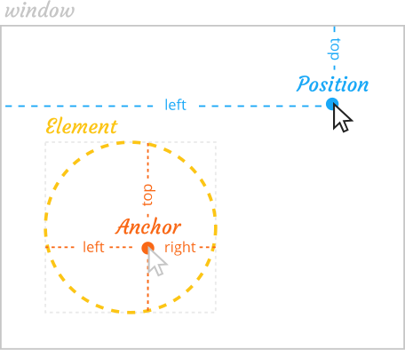
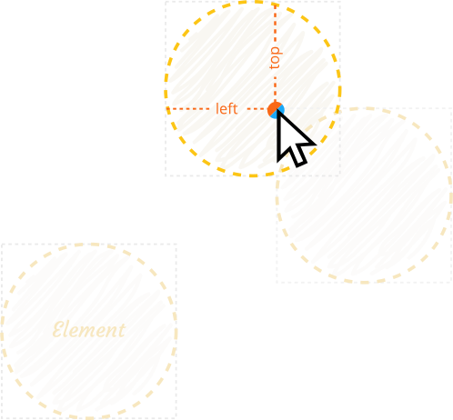

# Drag Event

The drag event is the event that emmits during dragging the different elements like handlers, lines and etc. It emits, for example, by [DraggableElement]('/components/draggable-element.html) component.

This event is represented by `DragEvent` class instance that has four fields:
- `nativeEvent` is the literally last native event related to this drag event
- `element` is the DOM element that was dragged
- `position` is the last position of cursor / touch represented by object with `left` and `top` fields relative to window
- `previousPosition` is the previos position of cursor / touch represented by object with `left` and `top` fields relative to window
- `anchor` is the geometry coordinates of the point in the handler where touch was started, it is represented by object with `left`, `top`, `right` and `bottom` fields and constant during the current dragging period

## Anchor

The anchor is the most misunderstood part of drag event. So let's investigate why is it needed.

The right approach to build a stencil resize algorithm is assuming that you don't know anything about the previous cursor / touch position. You just know current position of cursor / touch and current coordinates of handler.

We should resize stencil in a such way that the mouse cursor will be in **the exactly same point** of handler where user ends dragging. That's is what he anticipates.

But if we know only position the following result is the best result that we can ever get.

That's the moment when you need to use `anchor`. You just reduce or increase your resize box by anchor coordinates

## Shift method

The `DragEvent` instances have method `shift()` that will accurately calculate the resize shift corresponding to an anchor, a cursor / touch position and a handler position.

It returns the object with fields `left` and `top`. They will be negative if the corresponding position is decreasing and positive if the corresponding position is increasing.

For example, `left` is positive and `top` is negative at the picture above.
