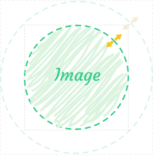

# Advanced stencil

## Idea

There will be described creating an one of possible croppers and you can apply this ideas to arbitrary cropper.

Let's consider the following cropper:


It's not like default stencil, at least because it has only one handler which is arranged not on the corner of a bounding box.

In addition, this cropper has different resize logic. Unlike the default stencil it expands in all directions simultaneously.



## Basic structure

A custom stencil is always a Vue component. In this tutorial we will create it as a single file component, but you may define it by any convenient way.

```html
<script>
export default {
	name: 'CircleStencil',
};
</script>

<template>
  <div class="circle-stencil"></div>
</template>

```

Let's define basic requirements to a typical stencil:
- it should receive and process service props from a cropper (`image`, `stencilCoordinates`)
- it should provide `aspectRatios` method that returns the object with `minimum` and `maximum` fields
- it should display the current cropped area
- it should emit resize and move events

## Props

First of all, it's need to describe service props

### `image`

This prop is the object, that describes the properties of image and has following properties:

- `src` - the link to the image 
- `width` - the image width
- `height` - the image height
- `transforms` - the transforms applied to image


### `cooordinates`

It's the object with `left`, `right`, `height` and `width` fields, that represents actual coordinates of the cropped fragment.

### `transitions`

It's the object that represent the current transition settings

### `stencilCoordinates`

It's the object with `left`, `right`, `height` and `width` fields, that represents desirable coordinates of stencil relative to visible area. In almost all cases you may use it as default coordinates for your absolute positioned stencil.

You should set the coordinates of your stencil **himself**. It was done on purpose, to give you possibility to create the custom stencil more flexible.

So pay attention on the computed property `style`


::: tip Notice!
The positions of the stencil is set by `transform` property. It's the optimal way
to prevent different lags and flickering.
:::

```html
<script>
export default {
	props: {
		image: {
			type: Object
		},
		coordinates: {
			type: Object,
		},
		transitions: {
			type: Object,
		},
		stencilCoordinates: {
			type: Object,
		},
	},
	computed: {
		style() {
			const { height, width, left, top } = this.stencilCoordinates;
			return {
				width: `${width}px`,
				height: `${height}px`,
				transform: `translate(${left}px, ${top}px)`
			};
		}
	}
};
</script>

<template>
  <div class="circle-stencil" :style="style"></div>
</template>
```

## Aspect ratios

Aspect ratios method should return an object with `minimum` and `maximum` fields. For current stencil it's `1` and `1` because it always should be a circle, but you may set their values according to such props as `aspectRatio`, `minAspectRatio` and `maxAspectRatio`.

```html
<script>
export default {
	props: {
		image: {
			type: Object
		},
		coordinates: {
			type: Object,
		},
		transitions: {
			type: Object,
		},
		stencilCoordinates: {
			type: Object,
		},
	},
	methods: {
		aspectRatios() {
			return {
				minimum: 1,
				maximum: 1
			};
		}
	},
	computed: {
		style() {
			const { height, width, left, top } = this.stencilCoordinates;
			return {
				width: `${width}px`,
				height: `${height}px`,
				transform: `translate(${left}px, ${top}px)`
			};
		}
	}
};
</script>

<template>
  <div class="circle-stencil" :style="style"></div>
</template>

<style>
.circle-stencil {
	position: absolute;
	cursor: move;
}
</style>
```

## Handler and preview

Now we should add the preview of the cropped area and handler. To display cropped area we will use the standard `StencilPreview` component, handler is the simple img ([download it]('/assets/handler.svg)).

```html
<script>

import { StencilPreview } from 'vue-advanced-cropper'

export default {
	components: {
		StencilPreview
	},
	props: {
		image: {
			type: Object
		},
		coordinates: {
			type: Object,
		},
		transitions: {
			type: Object,
		},
		stencilCoordinates: {
			type: Object,
		},
	},
	methods: {
		aspectRatios() {
			return {
				minimum: 1,
				maximum: 1
			};
		}
	},
	computed: {
		style() {
			const { height, width, left, top } = this.stencilCoordinates;
			return {
				width: `${width}px`,
				height: `${height}px`,
				transform: `translate(${left}px, ${top}px)`
			};
		}
	}
};
</script>

<template>
  	<div class="circle-stencil" :style="style">
	 	
        <stencil-preview
        	class="circle-stencil__preview"
			:image="image"
			:coordinates="coordinates"
			:width="stencilCoordinates.width"
			:height="stencilCoordinates.height"
			:transitions="transitions"
      	/>
  	</div>
</template>

<style>
.circle-stencil {
	border-radius: 50%;
	cursor: move;
	position: absolute;
	border: dashed 2px white;
	box-sizing: border-box;
	&__handler {
		position: absolute;
		right: 15%;
		top: 14%;
		z-index: 1;
		cursor: ne-resize;
		width: 30px;
		height: 30px;
		display: flex;
		align-items: center;
		justify-content: center;
		transform: translate(50%, -50%);
	}
	&__preview {
		border-radius: 50%;
		overflow: hidden;
	}
}
</style>
```


## Events handling

### Preparing

You may handle drag events himself, but this library provides two very useful components for this goal: `DraggableElement` and `DraggableArea`. The first  one is used for different handlers, lines and etc, the second one is used for dragging the stencil itself.

```html
<script>

import {
	StencilPreview,
	DraggableElement,
	DraggableArea
} from 'vue-advanced-cropper'

export default {
	name: 'CircleStencil',
	components: {
		StencilPreview,
		DraggableArea,
		DraggableElement
	},
	props: {
		image: {
			type: Object
		},
		coordinates: {
			type: Object,
		},
		transitions: {
			type: Object,
		},
		stencilCoordinates: {
			type: Object,
		},
	},
	methods: {
		aspectRatios() {
			return {
				minimum: 1,
				maximum: 1
			};
		}
	},
	computed: {
		style() {
			const { height, width, left, top } = this.stencilCoordinates;
			return {
				width: `${width}px`,
				height: `${height}px`,
				transform: `translate(${left}px, ${top}px)`
			};
		}
	}
};
</script>

<template>
  	<div class="circle-stencil" :style="style">
		<draggable-element
			class="circle-stencil__handler"
			@drag="onResize"
			@drag-end="onResizeEnd"
		>
			
		</draggable-element>
		<draggable-area @move="onMove" @move-end="onMoveEnd">
			<stencil-preview
				class="circle-stencil__preview"
				:image="image"
				:coordinates="coordinates"
				:width="stencilCoordinates.width"
				:height="stencilCoordinates.height"
				:transitions="transitions"
			/>
		</draggable-area>
 	</div>
</template>
```

Notice, we didn't define `onMove`, `onMoveEnd`, `onResize`, `onResizeEnd` handlers. It's time to do it.

### Moving stencil (`onMove`)

This handler will be straightforward. We just emit the received `moveEvent` above.

```js
onMove(moveEvent) {
	this.$emit('move', moveEvent);
}
```


### End moving stencil (`onMoveEnd`)

This handler will be straightforward. 
```js
onMoveEnd() {
	this.$emit('move-end');
}
```


### Moving handler (`onResize`)

It's the most complicated part of creating this custom stencil. We should process the mouse / touch moving and resize our handler accordingly.

Remember, that the [resize event](/events/resize-event.html) tells cropper, how much area should be changed in all four sides: `left`, `right`, `top`, `bottom`.


The draft of `onResize` method is represented below
```js
onResize(dragEvent) {
	// 1. Parsing the drag event to find out the resize factor
	// 2. Forming the resize event
}
```

#### Handling `dragEvent`

The `dragEvents` is the instance of [DragEvent](/events/drag-event.html) class. We should resize our handler in a such way that the mouse cursor will be in **the exactly same point** of handler where user ends dragging. That's is what he anticipates.

Fortunately, it has method `shift` that tells us the needed shift to achieve this task
```js
onResize(dragEvent) {
	const shift = dragEvent.shift()
	const widthResize = shift.left
	const heightResize = -shift.top
}
```
Notice, that we use negative value for `heightResize` because when the top position of the handler is decreasing `shift.top` will be negative, but stencil should resize in this case.

#### Emitting `resizeEvent`

It's is pretty easy:

```js
onResize(dragEvent) {
	const shift = dragEvent.shift()
	const widthResize = shift.leftz
	const heightResize = -shift.top
	this.$emit('resize', new ResizeEvent(
		{
			left: widthResize,
			right: widthResize,
			top: heightResize,
			bottom: heightResize,
		},
		{
			compensate: true,
		},
	));
}
```

### End moving handler (`onResizeEnd`)

This handler will be straightforward.

```js
onResizeEnd() {
	this.$emit('resize-end');
}
```


## Process transitions

To process the transitions we should customize the computed property `style`:

```js
style() {
	const { height, width, left, top } = this.stencilCoordinates;
	const style = {
		width: `${width}px`,
		height: `${height}px`,
		transform: `translate(${left}px, ${top}px)`
	};
	if (this.transitions && this.transitions.enabled) {
		style.transition = `${this.transitions.time}ms ${this.transitions.timingFunction}`;
	}
	return style;
}
```

## Result

The full ready-to-use source code of this example is [here](https://codesandbox.io/s/vue-advanced-cropper-custom-stencil-omseq?file=/src/Stencil.vue).

<advanced-stencil-example></advanced-stencil-example>

```html
<script>
import {
	DraggableElement,
	DraggableArea,
	StencilPreview,
	ResizeEvent
} from 'vue-advanced-cropper';

export default {
	components: {
		StencilPreview,
		DraggableArea,
		DraggableElement
	},
	props: {
		image: {
			type: Object
		},
		coordinates: {
			type: Object,
		},
		transitions: {
			type: Object,
		},
		stencilCoordinates: {
			type: Object,
		},
	},
	computed: {
		style() {
			const { height, width, left, top } = this.stencilCoordinates;
			const style = {
				width: `${width}px`,
				height: `${height}px`,
				transform: `translate(${left}px, ${top}px)`
			};
			if (this.transitions && this.transitions.enabled) {
				style.transition = `${this.transitions.time}ms ${this.transitions.timingFunction}`;
			}
			return style;
		}
	},
	methods: {
		onMove(moveEvent) {
			this.$emit('move', moveEvent);
		},
		onMoveEnd() {
        	this.$emit('move-end');
        },
		onResize(dragEvent) {
			const shift = dragEvent.shift();

			const widthResize = shift.left;
			const heightResize = -shift.top;

			this.$emit('resize', new ResizeEvent(
				{
					left: widthResize,
					right: widthResize,
					top: heightResize,
					bottom: heightResize,
				},
				{
					compensate: true,
				},
			));
		},
		onResizeEnd() {
        	this.$emit('resize-end');
        },
		aspectRatios() {
			return {
				minimum: 1,
				maximum: 1
			};
		}
	}
};
</script>

<template>
  <div
    class="circle-stencil"
    :style="style"
  >
    <draggable-element
      class="circle-stencil__handler"
      @drag="onResize"
      @drag-end="onResizeEnd"
    >
		
    </draggable-element>
    <draggable-area @move="onMove" @move-end="onMoveEnd">
      <stencil-preview
        class="circle-stencil__preview"
		:image="image"
		:coordinates="coordinates"
		:width="stencilCoordinates.width"
		:height="stencilCoordinates.height"
		:transitions="transitions"
      />
    </draggable-area>
  </div>
</template>

<style lang="scss">
.circle-stencil {
  border-radius: 50%;
  cursor: move;
  position: absolute;
  border: dashed 2px white;
  box-sizing: border-box;
  &__handler {
    position: absolute;
    right: 15%;
    top: 14%;
    z-index: 1;
    cursor: ne-resize;
    width: 30px;
    height: 30px;
    display: flex;
    align-items: center;
    justify-content: center;
    transform: translate(50%, -50%);
  }
  &__preview {
    border-radius: 50%;
    overflow: hidden;
  }
}
</style>
```
