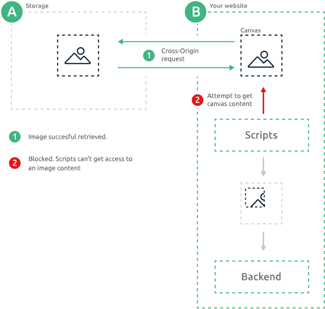

# Cross-Origin

## Introduction

Sometimes, you need to crop the images stored on some other origin (i.e. other domain, port or protocol).

Such requests are called [cross-origin requests](https://developer.mozilla.org/en-US/docs/Web/HTTP/CORS). For security reasons, browsers restrict cross-origin HTTP requests initiated from scripts.

> For example, you've authenticated on site A, where you store some private documents. Then you visit site B. It is able (strictly, it depends on same-site cookie policy) to display you your private images from the site A, but due the CORS policy site B can't get access to their content from scripts. So your documents in safety.

The situation when you need to get private images from an other site to crop ones seems unlikely, but the important part that you can't get the access to **any cross-origin images** from the scripts by default.

## How does it relate to cropper?

First of all there are two approaches to crop an image.

### Client-side

The most common approach is the cropping image on client-side and sending a cropped binary fragment to a backend. But there is a catch: scripts can't access to a content of cross-origin image by default as mentioned above. So they can't get the canvas content and can't form a binary data for a backend therefore.

This problem can be solved only by the appropriate storage configuring as written in the next section.



### Server-side

Otherwise, you can choice an area on client-side and send coordinates with an image link to your backend. A backend ignores the CORS policy, so it can be easily cropped on server side based on received coordinates.

To implement this approach just disable the using of the canvas to crop images by setting `canvas` prop to `false`.

## Configuring the storage

To allow scripts to get content of an image the [`Access-Control-Allow-Origin`](https://developer.mozilla.org/en-US/docs/Web/HTTP/Headers/Access-Control-Allow-Origin) header should be added to the image response headers.

```
Access-Control-Allow-Origin: https://website-with-cropper.me
```

If you have no access to storage this try to crop an image on the server-side or use some type of proxying.

The guides to configure CORS settings for different web storages:

- [Google Cloud](https://cloud.google.com/storage/docs/configuring-cors)

- [Amazon Cloud](https://docs.aws.amazon.com/AmazonS3/latest/dev/cors-troubleshooting.html)
