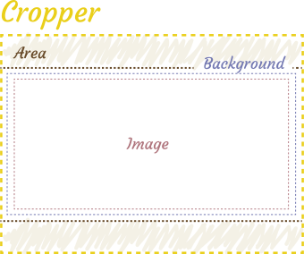
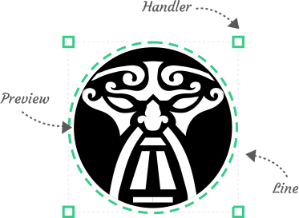

# Customize appearance

## Cropper

There are plenty of ways to customize cropper, and there will be described the most important ones.

Below schematically represented the internal structure of cropper and its main components.



### Cropper

To customize `cropper` itself, that can be imagined as wrapper for the `area`, `background` and `image`, you can pass class name to `classname` prop.

It can be useful if you want to set background of filled area at the scheme above or don't want to create and style cropper wrapper.

### Image

You can apply different effects (for example blurring) to image by passing custom class name to `imageClass` prop. By default it has `0.5` only opacity.

### Background

Background is literally background directly under image. By default it's black rectangle, but you are able to change, let's say, its color by passing class name to `backgroundClass` prop.

## Styling notice

There is only one way to change the styling of cropper and default stencils: add additional classes to them.
Passing inline styles is not supported now.

### Scoped styles

If you use `vue-loader` [scoped css](https://vue-loader.vuejs.org/guide/scoped-css.html), you will not be able to pass the scoped class name to stencil, 
background and image, because they are children components of cropper:
> With scoped, the parent component's styles will not leak into child components. However, a child component's root node will be affected by both the parent's scoped CSS and the child's scoped CSS. This is by design so that the parent can style the child root element for layout purposes.

To bypass this limitation you can:
- Use [not scoped classes](https://vue-loader.vuejs.org/guide/scoped-css.html#mixing-local-and-global-styles) for a background, stencil and image.
- Use [the deep selector](https://vue-loader.vuejs.org/guide/scoped-css.html#deep-selectors):
```html
<style scoped>
>>> .background {
	background: white;
}
</style>
```

## Stencil

There may be numerous different stencils with different ways to customize them. But there will be described customizing of default stencils like ([RectangleStencil](/components/rectangle-stencil.html) and [CircleStencil](/components/circle-stencil.html))



To customize stencil you should pass props to `stencilProps` props as object (read [here](/tutorials/recipes.html#passing-props-to-a-stencil) in detail)

### Handler

You are able to customize handle by the following ways:
- change handler component
- add custom handler classnames
- remove or add handlers at one of six positions


#### Change handler component

To change handler component just pass the name of globally registered handler component or handler component options object to `handlerComponent` prop.

```html
<cropper
	:src="img"
	:stencil-props="{
		handlerComponent: 'myHandler'
	}"
/>
```

#### Customize the classnames

To add handler classnames you should pass an object to `handlersClasses` prop. All available classnames are represented at the example below

```html
<cropper
	:src="img"
	:stencil-props="{
		handlersClasses: {
			default: 'handler',
			hover: 'handler--hover',
			eastNorth: 'handler--east-north',
			north: 'handler--north',
			westNorth: 'handler--west-north',
			west: 'handler--west',
			westSouth: 'handler--west-south',
			south: 'handler--south',
			eastSouth: 'handler--east-south',
			east: 'handler--ease',
		}
	}"
/>
```

Pay attention to `default` classname. If you want just change classname of a handler you should anyway pass an object:
```html
<Cropper
	:src="img"
	:stencil-props="{
		handlerClasses: {
			default: 'handler',
		}
	}"
/>
```

#### Customize the list of handlers

To change the list of handlers you should pass an object `handlers` to stencil props.

```html
<cropper
	:src="img"
	:stencil-props="{
		handlers: {
			eastNorth: true,
			north: false,
			westNorth: true,
			west: false,
			westSouth: true,
			south: false,
			eastSouth: true,
			east: false,
		}
	}"
/>
```

::: warning Remember!
If you don't set `[direction]: true` the correspondenting handler will be hidden, so if you pass an empty object all handlers will be hidden
:::

### Lines

You are able to customize lines by the same three ways:
- change line component (`lineComponent`)
- add custom line classnames (`linesClasses`)
- remove or add lines at one of four positions (`lines`)

Line component by default is [SimpleLine](/components/simple-line.html). Each line is a narrow block with applied border style. So to change the apperance of line you should change the border style.

The example is given below
```css
.line {
	border-style: dashed;
	border-color: red;
}
```

::: warning Know issue
Currently there are problems with changing the line width.
:::

### Preview

The necessity to change preview appearance is pretty rare. But if you want to change it you may pass custom classname to `previewClass` prop.

```html
<cropper
	:src="img"
	:stencil-props="{
		previewClass: 'preview'
	}"
	stencil-component="circle-stencil"
/>
```
```css
.preview {
	border: dashed 1px rgba(255,255,255, 0.25);
}
```

<customize-preview-example></customize-preview-example>
