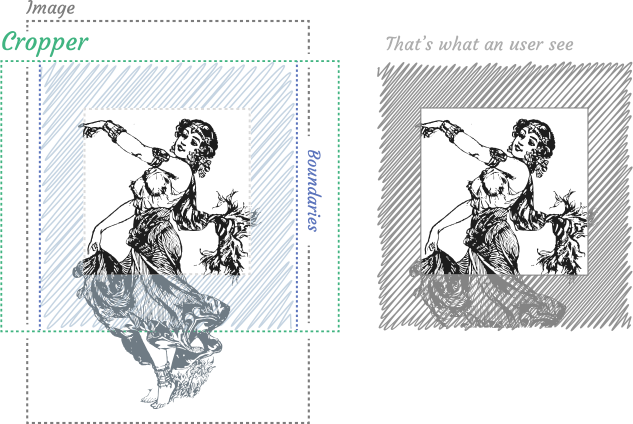
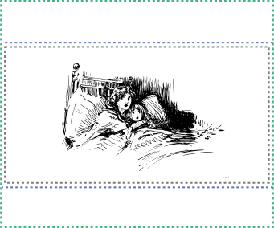
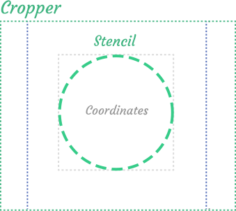
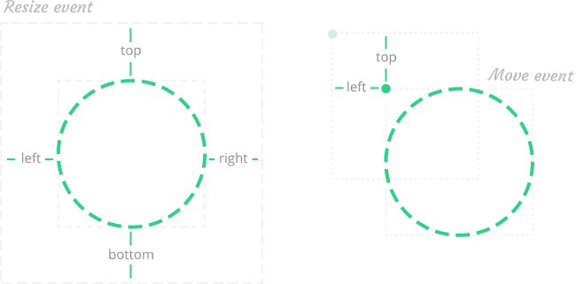
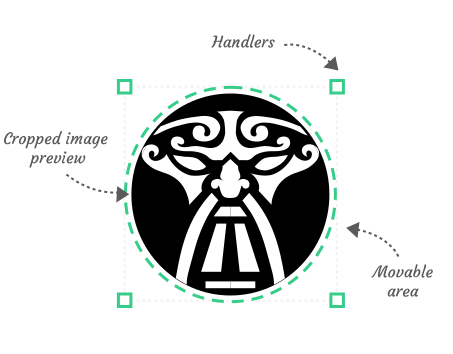

# Concepts

## Goals
The goal of this library to give a developer opportunity create any cropper easily and effortless. To achieve it the cropper is conceptually divided to two parts: broadly customizable `cropper` and arbitrary component `stencil`.

## Cropper

`Cropper` is the root component of this library. 

It is composed of three main parts: `boundaries`, `visibleArea` and `coordinates`. The conceptual scheme
below may look pretty complicated, but the first impression is misleading.


This scheme applied to the real image is shown below.




### Boundaries

It's the least obvious part of the cropper. Boundaries is the area inside the cropper that will contain an image.
By default, it is equal to an image fitted to a cropper.



But algorithm can be changed via `defaultBoundaries` prop to force an boundaries fill the cropper. 


### Visible area

The image is displayed inside the `boundaries`. But what's part of the image an user see? 
When image is not zoomed user sees the whole image, but what's the part of image an user sees when he zooms or translates image? 
This part can be called literally `visibleArea`.

The visible area is the most abstract, flexible and determined way to define the image zoom and translation. Remember,
it must have same aspect ratio as `boundaries` due its nature.


The visible area is defined by coordinates (`left`, `top`, `width`, `height`) relative to the image.

### Coordinates

The `coordinates` is the just cropped coordinates of an image (`left`, `top`, `width`, `height`) inside the `visibleArea` relative to the image.


## Stencil

Cropper operates the abstract box that represents current cropped area. But it just abstract couple of coordinates, to visualize the cropped area and give the possibility to interact with cropper there is a `stencil` component.



Stencil can be literally any arbitrary component, but to make sense there are some requirements to it:
- it should be inscribed to box is represented by coordinates (`width`, `height`, `left`, `top`)
- if stencil has aspect ratios it should has `aspectRatios` method to inform the cropper resize algorithm about it (this method should return object with minimum and maximum aspect ratio values)
- it should emit `resize` and `move` events
- it should display the cropped part of a image

Resize and move events are very flexible and allow you to create almost any moving and especially resizng logic



The typical stencil components are represented below. They includes handlers that emit resize events, movable area that emits move event and cropped image preview



There are default customizable components from a box that allow you to create your first cropper in five minutes.

```html
<script>
import { StencilPreview, BoundingBox, DraggableArea } from 'vue-advanced-cropper';

export default {
	components: {
		StencilPreview,
		BoundingBox,
		DraggableArea,
	},
	props: [
		// Image object
		'image',
		// Actual coordinates of the cropped fragment
		'coordinates',
		// Stencil size desired by cropper
		'stencilCoordinates',
		// Aspect ratios
		'aspectRatio',
		'minAspectRatio',
		'maxAspectRatio',
		// Transitions:
		'transitions'
	],
	computed: {
		style() {
			const { height, width, left, top } = this.stencilCoordinates;
			const style = {
				position: 'absolute',
				width: `${width}px`,
				height: `${height}px`,
				transform: `translate(${left}px, ${top}px)`,
			};
			if (this.transitions && this.transitions.enabled) {
				style.transition = `${this.transitions.time}ms ${this.transitions.timingFunction}`;
			}
			return style;
		},
	},
	methods: {
		onMove(moveEvent) {
			this.$emit('move', moveEvent);
		},
		onMoveEnd() {
			this.$emit('moveEnd');
		},
		onResize(resizeEvent) {
			this.$emit('resize', resizeEvent);
		},
		onResizeEnd() {
			this.$emit('resizeEnd');
		},
		aspectRatios() {
			return {
				minimum: this.aspectRatio || this.minAspectRatio,
				maximum: this.aspectRatio || this.maxAspectRatio,
			};
		},
	},
};
</script>

<template>
	<div :style="style">
		<bounding-box @resize="onResize" @resize-end="onMoveEnd">
			<draggable-area @move="onMove" @move-end="onMoveEnd">
				<stencil-preview
					:image="image"
					:width="stencilCoordinates.width"
					:height="stencilCoordinates.height"
					:coordinates="coordinates"
					:transitions="transitions"
				/>
			</draggable-area>
		</bounding-box>
	</div>
</template>
```

<simplest-stencil-example></simplest-stencil-example>
