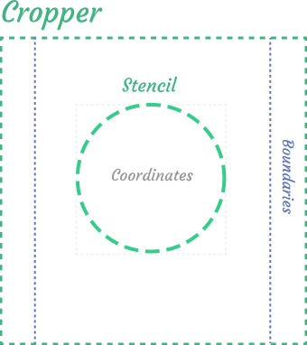

# Concepts

## Goals
The goal of this library to give a developer opportunity create any cropper easily and effortless. To achieve it the cropper is divided to two parts: broadly customizable `cropper` and arbitrary component `stencil`.

## Cropper

`Cropper` is the root component of this library. It contains coordinates of current cropped area (left, top, width, height) relative to original image coordinates. This coordinates can be imagined like `box`.


It responsible for:
- resizing and moving box
- displaying the cropping image and fitting it to container
- setting default coordinates
- cropping canvas area

## Stencil

Cropper operates the abstract box that represents current cropped area. But it just abstract couple of coordinates, to visualize the cropped area and give the possibility to interact with cropper there is a `stencil` component.



Stencil can be literally any arbitrary component, but to make sense there are some requirements to it:
- it should be inscibed to box is represented by coordinates (`width`, `height`, `left`, `top`)
- if stencil has aspect ratios it should has `aspectRatios` method to inform the cropper resize algorithm about it (this method should return object with minimum and maximum aspect ratio values)
- it should emit `resize` and `move` events
- it should display the cropped part of a image

Resize and move events are very flexible and allow you to create almost any moving and especially resizng logic


The typical stencil components are represented below. They includes handlers that emit resize events, movable area that emits move event and cropped image preview


There are default customizable components from a box that allow you to create your first cropper in five minutes.

```html
<script>
import {
  PreviewResult,
  BoundingBox,
  MoveableArea
} from 'vue-advanced-cropper';

export default {
  name: "MyStencil",
  components: {
    PreviewResult, BoundingBox, MoveableArea
  },
  props: [
    // Image src
    'img',
    // Coordinates of box relative to original image size
    'resultCoordinates',
    // Stencil size desired by cropper
    'stencilCoordinates',
    // Aspect ratios
    'aspectRatio', 'minAspectRatio', 'maxAspectRatio',
	],
	computed: {
		style() {
			const { height, width, left, top } = this.stencilCoordinates;
			return {
				width: `${width}px`,
				height: `${height}px`,
				left: `${left}px`,
				top: `${top}px`
			};
		}
	}
  methods: {
    onMove(moveEvent) {
      this.$emit('move', moveEvent)
    },
    onResize(resizeEvent) {
      this.$emit('resize', resizeEvent)
    },
    aspectRatios() {
      return {
          minimum: this.aspectRatio || this.minAspectRatio,
          maximum: this.aspectRatio || this.maxAspectRatio,
        }
    }
  },
};
</script>

<template>
  <div class="my-stencil" :style="style">
    <BoundingBox @resize="onResize">
      <MoveableArea @move="onMove">
        <PreviewResult
          :img="img"
          :classname="classes.preview"
		  		:resultCoordinates="resultCoordinates"
		  		:stencilCoordinates="stencilCoordinates"
        />
      </MoveableArea>
    </BoundingBox>
  </div>
</template>
```
